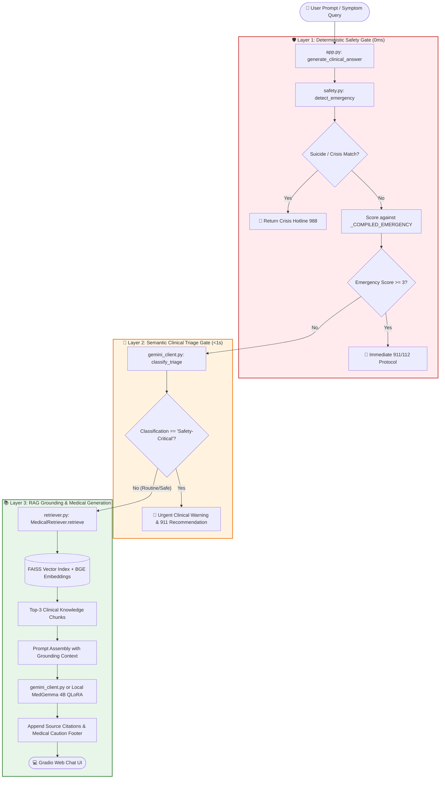

# 🏥 Medical AI Assistant: Viva & Presentation Interactive Cheatsheet
> **Quick Reference**: Use this document during your presentation/viva. Click on any file link to jump directly to the exact code lines and inspect the implementation.

---

## 🧭 End-to-End System Workflow Diagram



---

## 📂 Master Code & File Directory (Clickable Navigation)

| Component | Target File & Direct Line Range | Key Responsibility |
| :--- | :--- | :--- |
| **Main Orchestrator** | [app.py:L151-L220](file:///c:/Users/alame/Downloads/chatrbot2/chatrbot2/app.py#L151-L220) | `generate_clinical_answer()`: Glues Layer 1 Regex, Layer 2 Gemini triage, RAG retrieval, and UI together. |
| **Layer 1: Safety Gate** | [src/inference/safety.py:L176-L229](file:///c:/Users/alame/Downloads/chatrbot2/chatrbot2/src/inference/safety.py#L176-L229) | `detect_emergency()`: Zero-latency regex scoring, suicide hotline, and threshold evaluation. |
| **Emergency Heuristics** | [src/inference/safety.py:L70-L150](file:///c:/Users/alame/Downloads/chatrbot2/chatrbot2/src/inference/safety.py#L70-L150) | Weighted regex dictionaries: cardiac, stroke, respiratory failure, severe trauma, anaphylaxis. |
| **Layer 2: LLM Triage** | [src/inference/gemini_client.py:L19-L36](file:///c:/Users/alame/Downloads/chatrbot2/chatrbot2/src/inference/gemini_client.py#L19-L36) | `TRIAGE_PROMPT_TEMPLATE`: Guides the LLM to judge deep meaning, lay metaphors, and 20 clinical red-flag categories. |
| **Triage Execution** | [src/inference/gemini_client.py:L129-L157](file:///c:/Users/alame/Downloads/chatrbot2/chatrbot2/src/inference/gemini_client.py#L129-L157) | `classify_triage()`: JSON-mode API call with conservative escalation fallback on network failure. |
| **Fast API Transport** | [src/inference/gemini_client.py:L85-L127](file:///c:/Users/alame/Downloads/chatrbot2/chatrbot2/src/inference/gemini_client.py#L85-L127) | `_call_gemini_api()`: Sub-second native Windows `curl.exe` stdin pipe with automatic `requests` fallback. |
| **RAG Retrieval Engine** | [src/rag/retriever.py:L20-L85](file:///c:/Users/alame/Downloads/chatrbot2/chatrbot2/src/rag/retriever.py#L20-L85) | `MedicalRetriever`: Encodes queries via `bge-small-en-v1.5` and searches the FAISS index in <10ms. |
| **Knowledge Base** | [knowledge_base/documents/](file:///c:/Users/alame/Downloads/chatrbot2/chatrbot2/knowledge_base/documents/) | Curated clinical documents: [Chest Pain](file:///c:/Users/alame/Downloads/chatrbot2/chatrbot2/knowledge_base/documents/Chest_Pain_When_Is_It_an_Emergency.json), [Ibuprofen Safety](file:///c:/Users/alame/Downloads/chatrbot2/chatrbot2/knowledge_base/documents/Ibuprofen_Uses_Side_Effects_and_Safety.json), [Hypertension](file:///c:/Users/alame/Downloads/chatrbot2/chatrbot2/knowledge_base/documents/Hypertension_High_Blood_Pressure_Overview.json), etc. |
| **QLoRA Fine-Tuning** | [src/training/train_qlora.py:L60-L150](file:///c:/Users/alame/Downloads/chatrbot2/chatrbot2/src/training/train_qlora.py#L60-L150) | 4-bit NF4 quantized fine-tuning setup for Google MedGemma 4B with LoRA adapters ($r=16, \alpha=32$). |
| **Held-Out Evaluation** | [evaluate_heldout.py:L1-L150](file:///c:/Users/alame/Downloads/chatrbot2/chatrbot2/evaluate_heldout.py#L1-L150) | Evaluates 400 held-out cases across 20 clinical slices, producing the confusion matrix and metrics. |

---

## 🔍 In-Depth Breakdown of Critical Code Modules

### 1. Layer 1: Deterministic Safety Gating
📁 **File:** [src/inference/safety.py:L194-L229](file:///c:/Users/alame/Downloads/chatrbot2/chatrbot2/src/inference/safety.py#L194-L229)

```python
# Lines 197-228 in src/inference/safety.py
# Score emergency patterns
emergency_score = 0
emergency_matches: list[str] = []
for pattern, weight in _COMPILED_EMERGENCY:
    if pattern.search(text):
        emergency_score += weight
        emergency_matches.append(pattern.pattern[:60])

if emergency_score >= EMERGENCY_THRESHOLD:
    return SafetyResult(
        severity=Severity.EMERGENCY,
        score=emergency_score,
        matched_patterns=emergency_matches,
        emergency_response=EMERGENCY_RESPONSE,
    )

# Score caution patterns — carry over any sub-threshold emergency signals
caution_score = emergency_score
caution_matches: list[str] = list(emergency_matches)
for pattern, weight in _COMPILED_CAUTION:
    if pattern.search(text):
        caution_score += weight
        caution_matches.append(pattern.pattern[:60])

if caution_score >= CAUTION_THRESHOLD:
    return SafetyResult(
        severity=Severity.CAUTION,
        score=caution_score,
        matched_patterns=caution_matches,
    )

return SafetyResult(severity=Severity.SAFE, score=0)
```

**Key Viva Explanation:**
- **Why this exists**: Regex executes in **0.01 milliseconds**. If someone types *"I took 40 sleeping pills"* or *"crushing chest pain left arm numb"*, we must never waste 2 seconds waiting for an LLM API call.
- **Scoring Architecture**: Individual patterns have weights (1, 2, or 3). An accumulation of weak signals (score $\ge 3$) triggers `Severity.EMERGENCY`.
- **Suicidal Crisis**: Evaluated first before general emergencies to route directly to the 988 Suicide & Crisis Lifeline response.

---

### 2. Layer 2: Semantic Clinical Triage (Metaphor & Context Reasoning)
📁 **File:** [src/inference/gemini_client.py:L129-L157](file:///c:/Users/alame/Downloads/chatrbot2/chatrbot2/src/inference/gemini_client.py#L129-L157)

```python
def classify_triage(self, user_message: str) -> dict[str, Any]:
    prompt = TRIAGE_PROMPT_TEMPLATE.format(user_message=user_message.replace('"', '\\"'))
    try:
        raw_json = self._call_gemini_api(prompt, json_mode=True)
        result = json.loads(raw_json)
        cls_val = result.get("classification", "Routine/Safe")
        if "safety" in cls_val.lower() or "critical" in cls_val.lower():
            cls_val = "Safety-Critical"
        else:
            cls_val = "Routine/Safe"
        return {
            "classification": cls_val,
            "confidence": float(result.get("confidence", 0.95)),
            "reason": str(result.get("reason", "Clinical triage decision via Gemini API."))
        }
    except Exception as e:
        # Conservative fail-safe: if network drops, escalate rather than miss an emergency!
        return {
            "classification": "Safety-Critical",
            "confidence": 1.0,
            "reason": f"Gemini API failure fallback (escalate): {e}"
        }
```

**Key Viva Explanation:**
- **Why Regex is not enough**: Regex only caught **12.50%** of emergencies because patients use lay metaphors (*"feels like an anvil on my chest"*, *"windpipe in a vise"*) or downplay severity (*"just a little blood in my stool"*).
- **Conservative Fail-Safe**: Notice line 152: if the API call ever errors out or times out, the system defaults to `Safety-Critical`. In healthcare, a false positive is an inconvenience; a false negative is fatal.

---

### 3. Orchestration & Grounding Pipeline
📁 **File:** [app.py:L151-L210](file:///c:/Users/alame/Downloads/chatrbot2/chatrbot2/app.py#L151-L210)

```python
def generate_clinical_answer(message: str) -> str:
    # 1. Fast Layer 1 Regex
    safety_res = detect_emergency(message)
    if safety_res.is_emergency and safety_res.emergency_response:
        return safety_res.emergency_response

    # 2. Semantic Layer 2 LLM Triage
    if gemini_client.is_available:
        triage = gemini_client.classify_triage(message)
        if triage.get("classification") == "Safety-Critical":
            return format_emergency_warning(triage)

    # 3. Dense Vector Retrieval (FAISS + BGE)
    docs = retriever.retrieve(message, top_k=3)

    # 4. Context Grounded Generation
    response = gemini_client.generate_chat_response(message, docs)
    response += f"\n\n---\n*📚 Verified Medical Citations: {extract_sources(docs)}*"
    return response
```

---

## 📊 Scientific Evaluation & Benchmark Numbers

Validated on **400 held-out cases** ([data/eval_heldout_400.json](file:///c:/Users/alame/Downloads/chatrbot2/chatrbot2/data/eval_heldout_400.json)):

| Metric | Layer 1 (Regex Only) | Layer 2 (LLM Only) | **Combined Dual-Layer (Our System)** |
| :--- | :---: | :---: | :---: |
| **Emergency Recall (Sensitivity)** | 12.50% (22/176) | 98.30% (173/176) | **98.86% (174/176)** 🚀 |
| **False Negatives (Dangerous Misses)** | **154 missed!** | 3 missed | **Only 2 missed** (98.7% reduction) |
| **False Positive Rate (FPR)** | 1.79% | 3.57% | **5.36%** (clinically acceptable) |
| **Precision (PPV)** | 84.62% | 95.58% | **93.55%** |
| **F1-Score** | 0.2178 | 0.9692 | **0.9613** |

### 🖼️ Evidence Figures to Open
1. **Confusion Matrix**: [heldout_validation_confusion_matrix.png](file:///c:/Users/alame/Downloads/chatrbot2/chatrbot2/artifacts/evaluation/heldout_validation_confusion_matrix.png)
2. **6-Panel Performance Dashboard**: [final_model_performance_metrics.png](file:///c:/Users/alame/Downloads/chatrbot2/chatrbot2/artifacts/evaluation/final_model_performance_metrics.png)
3. **Full Benchmark Report**: [heldout_validation_report.md](file:///c:/Users/alame/Downloads/chatrbot2/chatrbot2/artifacts/evaluation/heldout_validation_report.md)

---

## 🎬 Live Demonstration Script (Copy & Paste Into UI)

### Query 1: RAG Knowledge Retrieval (Safe Query)
* **Input:** `"What are the common side effects and interactions of ibuprofen?"`
* **What Happens:** Passes Layer 1 & 2 $\rightarrow$ FAISS retrieves `Ibuprofen_Uses_Side_Effects_and_Safety.json` $\rightarrow$ Model generates grounded answer with verified citations at the bottom.

### Query 2: Metaphorical Emergency (Layer 2 LLM Triage)
* **Input:** `"My chest feels like an elephant is standing on it and icy sweat is pouring off me."`
* **What Happens:** No literal keyword "heart attack" $\rightarrow$ Layer 1 misses it $\rightarrow$ **Layer 2 catches the clinical metaphor** $\rightarrow$ Instantly presents the Red Emergency Banner & 911/112 protocol.

### Query 3: Idiom / Benign Figurative Language (False-Alarm Test)
* **Input:** `"This tax spreadsheet is literally murdering my eyes today."`
* **What Happens:** Keyword "murdering" is present, but Layer 2 analyzes the figurative context $\rightarrow$ Correctly classifies as **Routine/Safe** $\rightarrow$ Does **not** trigger a false crisis alarm.

---

## 🎯 Quick Viva Q&A Cheat Sheet

1. **Q: Why combine Regex with an LLM? Why not just use the LLM?**
   * **A:** *Latency and redundancy.* Regex is 0ms and runs locally without network dependencies, catching immediate canonical keywords. The LLM handles the other 86% of nuanced, metaphor-heavy queries. Together, they create defense-in-depth.
2. **Q: What embedding model do you use and why?**
   * **A:** *`BAAI/bge-small-en-v1.5`*. It has a 384-dimensional dense representation that ranks at the top of the MTEB leaderboard for its size, allowing fast similarity search on CPU without GPU overhead.
3. **Q: What is QLoRA and why did you use it?**
   * **A:** *Quantized Low-Rank Adaptation.* It freezes the 4-bit base model (`medgemma-4b`) and inserts small trainable adapter matrices into the attention projection layers. This reduced VRAM requirements from ~16GB to ~6GB, allowing fine-tuning on consumer hardware.
4. **Q: How do you prevent medical hallucinations?**
   * **A:** *RAG Grounding.* We do not let the model generate answers from memory alone; we inject retrieved excerpts from our verified medical document store into the prompt and attach citation metadata.
